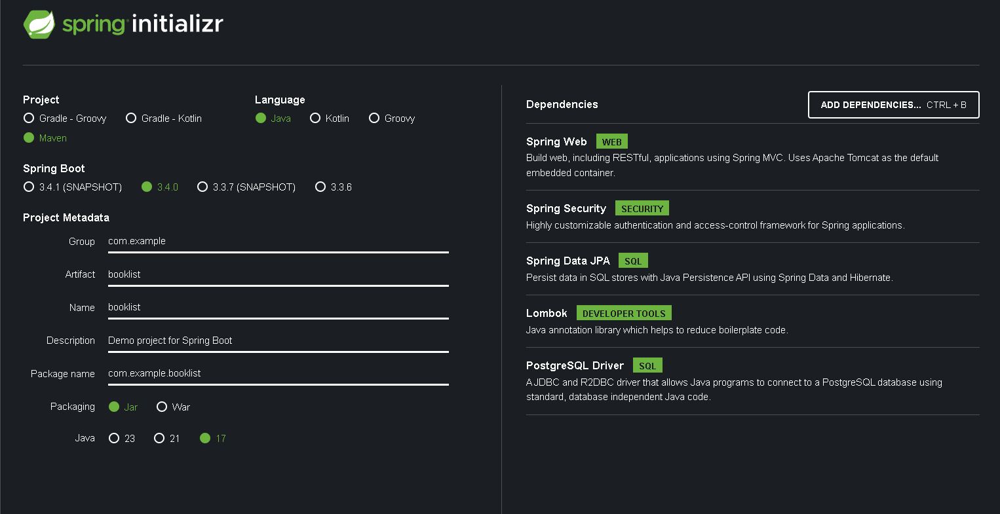

## Description
Demo Spring Boot project with `user` authentication. Using PostgreSQL Database and Spring Security with **Java Web Tokens** (jwt). 
In this example User can add books to its list and mark them as either read or not.

## Project Setup

### Spring initializer

Project setup in https://start.spring.io/

Base of the project is generate with settings and dependencies shown in an image below.

   

#### Settings:
* Project: **Maven**
* Spring boot: **3.4.0**
* Java: **17**
* **Dependencies**:
  * Spring Web
  * Spring Data JPA
  * Lombok
  * PostgreSQL Driver
  * Spring Security

#

#### All Dependencies (pom.xml)

Dependencies including JWT need to be added manually (Marked in the table bellow).

| groupId | artifactId | version |
| :-: | :-: | :-: |
| org.springframework.boot | spring-boot-starter-data-jpa | defined by POM |
| org.springframework.boot | spring-boot-starter-security | defined by POM |
| org.springframework.boot | spring-boot-starter-web | defined by POM |
| org.postgresql | postgresql | defined by POM |
| org.projectlombok | lombok | defined by POM |
| io.jsonwebtoken | **jjwt-api** | 0.11.3 |
| io.jsonwebtoken | **jjwt-impl** | 0.11.5 |
| io.jsonwebtoken | **jjwt-jackson** | 0.11.5 |
| org.springframework.boot | spring-boot-starter-test | defined by POM |
| org.springframework.security | spring-security-test | defined by POM |

#

#### Notes
* In `pom.xml` file add **jwt** dependencies from the provided file `booklist/pom.xml`. (Check the section above)
* P. S. Copy whole `booklist/pom.xml`, if you get problems with **Lombok**.
Or just change `<build></build>` section:

```xml
<build>
		<plugins>
			<plugin>
				<groupId>org.apache.maven.plugins</groupId>
				<artifactId>maven-compiler-plugin</artifactId>
				<version>3.13.0</version>
				<configuration>
					<source>${java.version}</source>
					<target>${java.version}</target>
					<annotationProcessorPaths>
						<path>
							<groupId>org.projectlombok</groupId>
							<artifactId>lombok</artifactId>
							<version>1.18.36</version>
						</path>
					</annotationProcessorPaths>
				</configuration>
			</plugin>
			<plugin>
				<groupId>org.springframework.boot</groupId>
				<artifactId>spring-boot-maven-plugin</artifactId>
			</plugin>
		</plugins>
	</build>
```


* Change `application.properties` to connect to your DB.

## Endpoints

| Endpoint | HTTP Method | Description |
| :- | :-: | :-: |
| /api/auth/regiter | POST | Register new user |
| /api/auth/login | POST | Login user |
| /api/auth/logout | POST | Logout user |
| /api/demo-controller | GET | Demo request |
| /api/users/profile | GET | Get users' data |
| /api/users/profile | PUT | Update users' data |
| /api/users/{id} | DELETE | Delete user |
| /api/books | POST | Create book |
| /api/books/{id} | GET | Get book data |
| /api/books/{id} | PUT | Update book data |
| /api/books/{id} | DELETE | Delete book |
| /api/books | GET | Get all books data |

## Sources
1. https://youtu.be/9SGDpanrc8U?si=HABuERsduWAb8vKi
2. https://youtu.be/aHbE3pTyG-Q?si=mW6r-AkCir3h6zoj
3. https://youtu.be/KxqlJblhzfI?si=10LN8SFo4FDAjheX 
4. https://youtu.be/b9O9NI-RJ3o?si=YP8KgKEv_L4MytE1
5. https://youtube.com/@amigoscode?si=hsh7RsH8y4BKUeb3
6. https://chatgpt.com/
7. https://www.toptal.com/spring/spring-security-tutorial
8. https://medium.com/devdomain/using-lombok-in-spring-boot-simplifying-your-code-c38057894cb8
